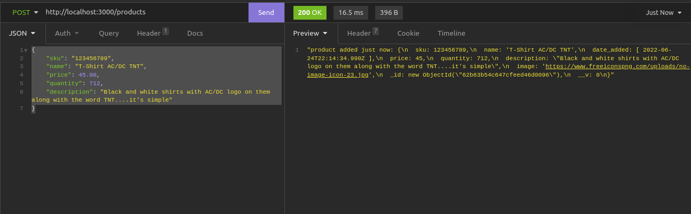
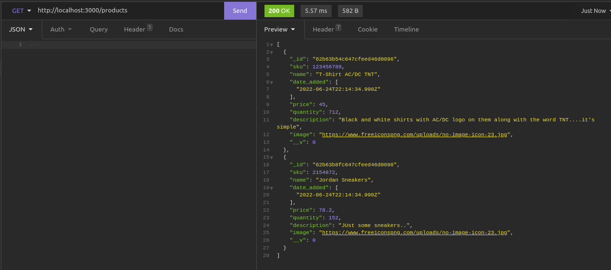
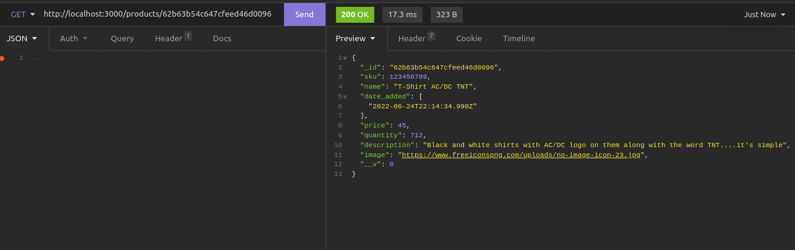
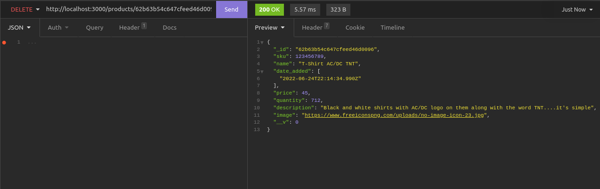

# EE-commerce
commerce 

# NODE BACKEND  
The node backend is a RESTful API allowing for basic CRUD operations on a PRODUCT entity.  

**ROUTES**

Route | Verb | Description
-|-|-
 / | GET    | List all products  
 /:id | GET    | Get one product by ID
 /:id | POST | Create one product
 /:id | PUT | Update one product
 /:id | DELETE | Delete one product

